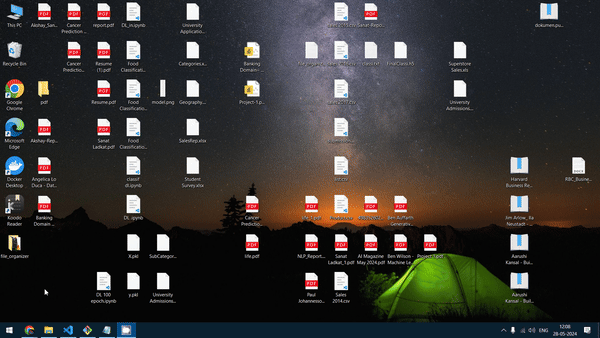
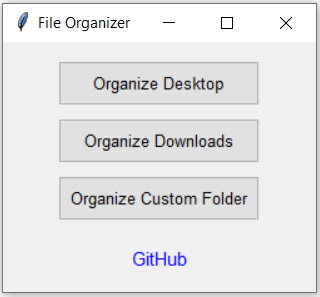
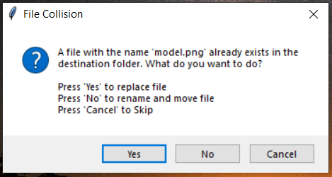

# File Organizer

This Python script provides a graphical interface to organize files in your Desktop, Downloads, and any custom folder. It categorizes files by type into separate folders, helping you maintain a clean and organized digital workspace.



## Features

- **Organize Desktop**: Automatically fetches the path of the Desktop and arranges all files into folders based on file types.
- **Organize Downloads**: Fetches the path of the Downloads folder and organizes files into folders based on file types.
- **Custom Folder**: Allows users to specify a folder path, and the script organizes files in that folder based on file types.
- **Error Handling**: Manages errors related to non-existent folders or permission issues.
- **File Collision Handling**: Prompts the user to overwrite, rename, or skip files with the same name.
- **User Confirmation**: Asks for user confirmation before organizing files, especially for the Desktop and Downloads folders.
- **Logging**: Logs all file movements, providing a history of actions performed by the script.

## Requirements

- Python 3.x
- Tkinter (usually comes pre-installed with Python)
- PyInstaller (for creating executable, if needed)

## Installation

1. **Clone the repository:**

    ```bash
    git clone https://github.com/sanatladkat/File-Organizer.git
    cd File-Organizer
    ```

2. **Install dependencies:**

    ```bash
    pip install -r requirements.txt
    ```

3. **Run the script:**

    ```bash
    python file_organizer.py
    ```

## Usage


1. **Organize Desktop**: Click the "Organize Desktop" button. The program will fetch the Desktop path and organize files into folders based on file types.

2. **Organize Downloads**: Click the "Organize Downloads" button. The program will fetch the Downloads folder path and organize files into folders based on file types.

3. **Custom Folder**: Click the "Organize Custom Folder" button. Select a folder through the dialog, and the program will organize files in that folder based on file types.


## File Collision Handling



When a file with the same name already exists in the destination folder, the program will prompt you with three options:

1. **Yes**: Overwrite the existing file.
2. **No**: Rename the file being moved.
3. **Cancel**: Skip moving the file.

## Logging

The program maintains a log file named `file_organizer.log` in the script's directory. This log keeps track of all file movements, helping you see a history of the actions performed by the application.

## Creating an Executable

To create an executable using PyInstaller, follow these steps:

1. **Install PyInstaller:**

    ```bash
    pip install pyinstaller
    ```

2. **Create the executable:**

    ```bash
    pyinstaller --onefile file_organizer.py
    ```

3. The executable will be created in the `dist` directory.

## Download executable : [Download File Organizer](File_Organizer.exe)

## Contributing

Contributions are welcome! If you have ideas for improvements or new features, please open an issue or submit a pull request.


## Contact

If you have any questions, feel free to contact me via the issues section of this repository.

---

GitHub Repository: [File Organizer](https://github.com/sanatladkat/File-Organizer)
